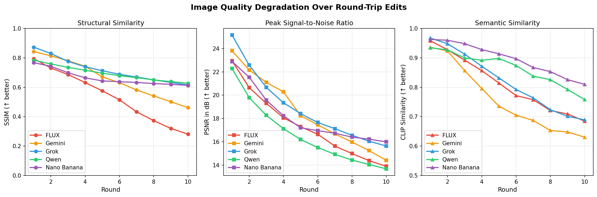
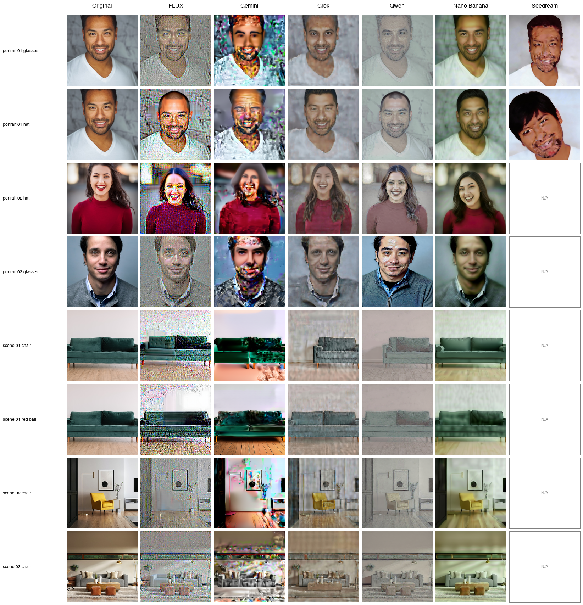

# ConvergeBench

A benchmark for evaluating **iterative robustness** of image editing models.

## Motivation

Real users don't edit once—they iterate: *"add glasses"* → *"remove them"* → *"try sunglasses instead."* Current benchmarks test single-shot edit quality, but not **quality degradation over multiple iterations**.

**Core Thesis**: A good editing model should enable **convergent iteration**—users can make repeated edits without accumulated artifacts or unintended drift.

## Key Findings

We tested 5 state-of-the-art image editing models over 10 round-trip edit cycles:

| Model | SSIM @ R10 | CLIP @ R10 | Speed |
|-------|------------|------------|-------|
| **Qwen Edit** | **0.618** | **0.770** | 7.2s |
| **Nano Banana** | 0.601 | 0.770 | 28.5s |
| **Grok Imagine** | 0.582 | 0.680 | 10.5s |
| Gemini Flash | 0.451 | 0.645 | 6.1s |
| FLUX Kontext | 0.282 | 0.676 | 4.1s |

**Key insight**: Qwen and Grok maintain >50% structural similarity after 10 round-trips, while FLUX degrades to <30%.



## Approach: Round-Trip Testing

We test models by performing round-trip edits:

```
I₀ → edit("add glasses") → I₁ → edit("remove glasses") → I₁'
   → edit("add glasses") → I₂ → edit("remove glasses") → I₂'
   → ... (N round-trips)
```

The original image `I₀` serves as ground truth. We measure how much `Iₙ'` diverges from `I₀` as `n` increases.



## Metrics

**Quality Preservation:**
- **PSNR** (Peak Signal-to-Noise Ratio) — pixel-level fidelity
- **SSIM** (Structural Similarity Index) — structural preservation
- **LPIPS** (Learned Perceptual Similarity) — perceptual quality

**Semantic Consistency:**
- **CLIP Similarity** — semantic meaning preservation

## Installation

```bash
git clone https://github.com/Qianli-ion/edit-converge-bench.git
cd edit-converge-bench
python -m venv .venv
source .venv/bin/activate
pip install -r requirements.txt
```

### API Keys

Set the following environment variables:
```bash
export FAL_KEY="your-fal-ai-key"        # For FLUX, Grok, Qwen, Seedream, Nano Banana
export GEMINI_API_KEY="your-google-key"  # For Gemini (direct API)
```

## Usage

### Run Benchmark

```bash
# Run a single model
python eval/run_smart_benchmark.py --model qwen --max-rounds 10 --output-dir results_qwen

# Resume interrupted run (skips completed evaluations)
python eval/run_smart_benchmark.py --model qwen --max-rounds 10 --resume

# Available models: gemini, flux-dev, flux-pro, grok, qwen, seedream, nano-banana-edit
```

### Generate Results

```bash
# Export all results to CSV
python export_results_csv.py

# Generate degradation curve plots
python plot_degradation_curves.py

# Generate visual comparison grid
python create_model_comparison.py

# Print metrics summary
python generate_metrics_report.py
```

## Project Structure

```
edit-converge-bench/
├── data/
│   ├── images/              # Source images (portraits, scenes)
│   ├── images.json          # Image metadata
│   └── edit_pairs.json      # (forward, backward) prompt pairs
├── models/
│   ├── base.py              # Abstract model interface
│   ├── gemini.py            # Gemini/Nano Banana (Google API)
│   ├── flux.py              # FLUX Kontext (FAL)
│   └── fal_models.py        # Grok, Qwen, Seedream, Nano Banana (FAL)
├── metrics/
│   ├── quality.py           # PSNR, SSIM, LPIPS
│   └── semantic.py          # CLIP similarity
├── eval/
│   ├── run_smart_benchmark.py  # Main benchmark runner
│   └── compute_metrics.py      # Aggregate results
├── results_comparison/
│   ├── benchmark_results_detailed.csv   # Full results (4,474 rows)
│   ├── benchmark_summary_by_round.csv   # Per-round averages
│   ├── benchmark_summary_final.csv      # Final rankings
│   ├── degradation_curves.png           # Metric plots
│   └── model_comparison_round10.png     # Visual comparison
└── results_*/                # Raw results per model
```

## Models Evaluated

| Model | Provider | API | Status |
|-------|----------|-----|--------|
| Gemini 2.5 Flash Image | Google | Direct | ✅ Complete |
| FLUX Kontext Dev | Black Forest Labs | FAL | ✅ Complete |
| Grok Imagine | xAI | FAL | ✅ Complete |
| Qwen Edit | Alibaba | FAL | ✅ Complete |
| Nano Banana Edit | Google | FAL | ✅ Complete |
| Seedream v4.5 | ByteDance | FAL | 🔲 Partial |

## Results

Full results available in `results_comparison/`:

- **[benchmark_results_detailed.csv](results_comparison/benchmark_results_detailed.csv)** — Every metric for every round
- **[benchmark_summary_final.csv](results_comparison/benchmark_summary_final.csv)** — Final rankings at round 10
- **[benchmark_by_experiment.csv](results_comparison/benchmark_by_experiment.csv)** — Per-experiment breakdown

### Cost & Speed Comparison

| Model | $/image | sec/image | Full Benchmark Cost |
|-------|---------|-----------|---------------------|
| Qwen Edit | ~$0.02 | 7.2s | ~$26 |
| FLUX Kontext | ~$0.025 | 4.1s | ~$33 |
| Nano Banana | ~$0.039 | 28.5s | ~$51 |
| Seedream | ~$0.04 | - | ~$53 |
| Grok Imagine | ~$0.05 | 10.5s | ~$86 |

*Full benchmark = 66 evaluations × 10 rounds × 2 edits = 1,320 API calls*

## Citation

```bibtex
@misc{convergebench2026,
  title={ConvergeBench: Measuring Iterative Robustness of Image Editing Models},
  author={Feng, Qianli},
  year={2026},
  url={https://github.com/Qianli-ion/edit-converge-bench}
}
```

## License

MIT
